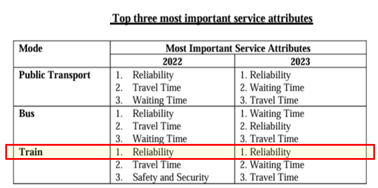
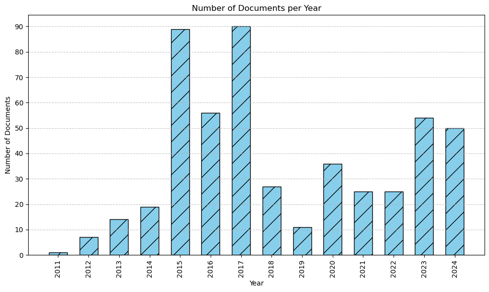
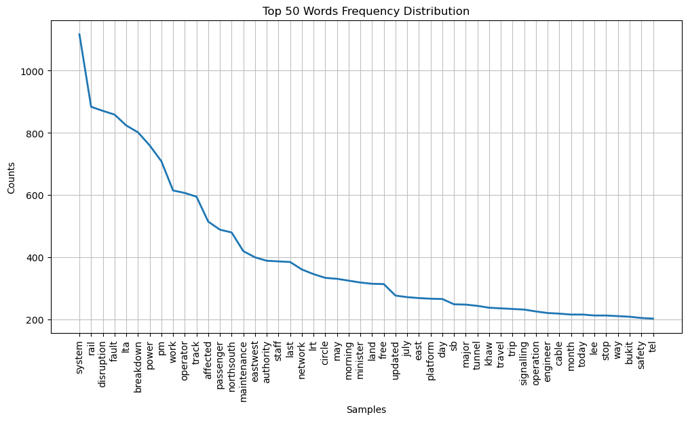
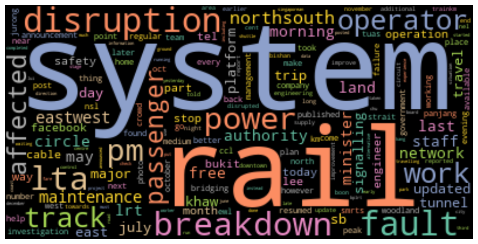
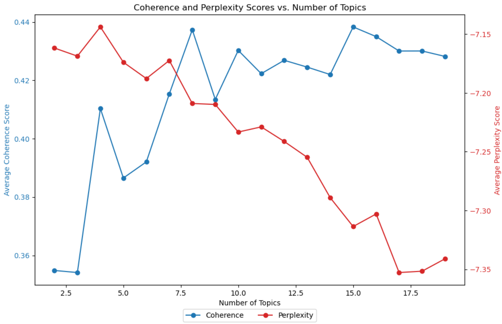
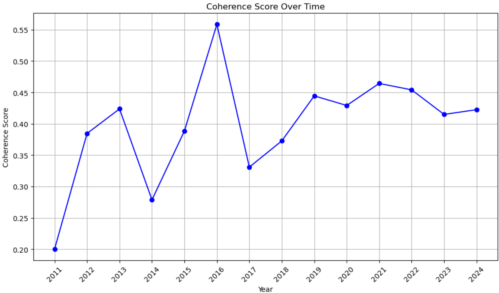
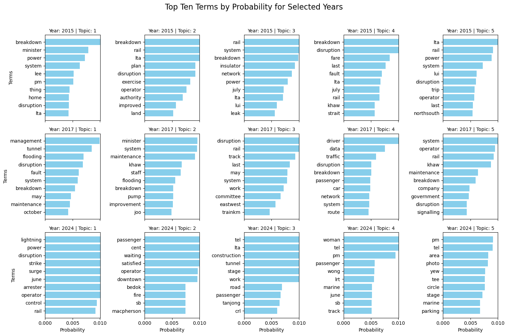

## Project Background
Singapore's Mass Rapid Transit (MRT) system is a critical component of the city's public transportation infrastructure, serving millions of commuters daily. 

Singapore Public Transport Council (PTC) completed a survey in Apr 2024.
 *Data Source: https://www.ptc.gov.sg/newsroom/news-releases/newsroom-view/ptc-s-survey-findings-on-customers--satisfaction-with-public-transport*

Commuters felt that train reliability is the most important service component to them, followed by travel time and then next after is safety/security.

Ensuring the reliability of the MRT is essential for minimizing disruptions and ultimately enhancing the overall commuter experience.

This project aims to improve the reliability of the Singapore MRT system by analyzing online news reports using dynamic topic modeling (DTM). 
 The goal is to identify underlying issues that evolve over time and provide actionable insights for targeted interventions.

Business Objective = Improve the commuter experience of the Singapore MRT system

Data mining goal: To identify the factors contributing to MRT train reliability

## Work Accomplished
To address the project objectives, the task can be broken down to the following problem statements:
<ol>
  <li style="color: red;">How can we systematically analyze and interpret large volumes of textual data related to MRT breakdowns and reliability?</li>
  <li style="color: red;">What are the key issues affecting MRT reliability, and how do they evolve over time?</li>
  <li style="color: red;">How can insights from dynamic topic modeling be used to prioritize maintenance and operational interventions?</li>
</ol>

### Data Preparation
504 documents/articles were collected by using webscrapper (Parsehub) and tagged by the date of publish.
 Data Collection Sources:
 - Local news websites (Straits Times, CNA, Mothership, AsiaOne, Today, Independent Singapore, Yahoo News, STOMP, SG Carmart)
 - Malaysia news websites (The Star, Malay Mail)

Exploratory Data Analysis (EDA) was carried out on the 504 documents/articles collected.

Text data was cleaned and tokenized to ensure consistency and accuracy in analysis.
 Lemmatization was applied reduce words to their base form.
 A custom stopword list was applied to remove irrelevant terms and focused on domain-specific vocabulary (ie word terms related to train reliability).

Frequency distribution and word cloud plots show the term words distribution.

### Modelling
Dynamic Topic Modeling (DTM) was implemented to analyze how topics related to MRT reliability evolved over time.
 This model allows for the systematic analysis and interpretation of large volumes of textual data related to MRT breakdowns and reliability. (Solution to Problem statement 1)

The optimal number of topics and other hyperparameters were fine-tuned to capture meaningful patterns.

Below shows that the highest coherence before the curve plateau occurs at number of topics 8, which is the optimal case.
 So number of topics was fixed at 8 as key modelling parameter.

### Evaluation
Assessed the model's performance using coherence scores to ensure the quality and interpretability of the topics generated.

Coherence scores remain relatively stable over the years with no dips or significant drops in coherence scores.

Visualized the top terms associated with each topic and their evolution across different time periods.

For example for Topic 1, in 2015, the key issues were breakdown of power system components. 
 But in 2017, the Topic 1 issues were replaced by flooding due to maintenance problems.
  In 2024, the main issues were lightning strikes which cause failure to arrestor.
 From these visualizations, we can see key topics affecting MRT reliability and how they evolve over time. (Solution to Problem statement 2)

## Recommendation and Analysis
Based on the dynamic topic modeling analysis, several key findings and recommendations emerged:

**Key Findings (Data from 2011 to 2024)**:
- **Seasonal Variation in Topics**: The analysis revealed a notable shift in the prevalence of topics over the years. Specifically, topics discussed during the November-December period have been declining in prominence, while those during May-June have become more prevalent. This could indicate changes in commuter behavior, operational challenges, or external factors influencing MRT reliability during these periods.
  
- **Rising Focus on Specific Stations**: Since 2022, there has been a marked increase in the intensity of topics related to specific MRT and LRT stations, particularly Kranji, Bedok, and Harborfront. These stations have seen an uptick in articles, which could point to localized issues, such as increased passenger load, infrastructure challenges, or other operational concerns.

- **Fault Detection vs. Breakdown Incidents**: While the number of breakdown incidents has decreased in recent years, the analysis highlights an increase in the detection of faults. This trend suggests that the MRT system's monitoring and diagnostic capabilities have improved, enabling the identification of potential issues before they lead to breakdowns. However, it also indicates a growing need to address detected "faults" proactively to prevent future service disruptions.

- **Nighttime Operations**: The frequency of topics related to "night" operations has been rising steadily up to 2024. This could reflect challenges specific to nighttime disruptions, which may require targeted attention.

### Recommendations

1. **Seasonal and Temporal Analysis**:
   - **Targeted Resource Allocation**: Given the seasonal variation in topic prevalence, it is recommended that MRT operations consider allocating resources more strategically throughout the year. For example, increasing maintenance and operational support during May-June, when issues are more prevalent, could help mitigate potential disruptions.
   
   - **Enhanced Monitoring During Key Periods**: The declining focus on November-December should not lead to complacency. Instead, maintaining robust monitoring during this period can help ensure that the lower prominence of topics is consistently maintained.

2. **Station-Specific Interventions**:
   - **Focused Attention on High-Risk Stations**: The increase in topic intensity around Kranji, Bedok, and Harborfront stations suggests that these locations may require enhanced operational focus. Interventions could include more frequent inspections, infrastructure upgrades, or increased staffing during peak hours.
   
   - **Community Engagement**: Engage with commuters and local communities at these stations to gather additional insights that may not be captured in the data. This can provide a more holistic understanding of the issues and help tailor interventions to the specific needs of these areas.

3. **Proactive Maintenance Strategies**:
   - **Predictive Maintenance Enhancement**: The trend of increasing fault detection with fewer breakdowns suggests that predictive maintenance strategies are already yielding benefits. To build on this success, MRT operations should consider further refining these strategies by focusing on the periods and locations where faults are more likely to occur. For example, intensifying predictive maintenance efforts during the times when "signal faults" are more likely to appear as topics can help prevent these issues from escalating into service disruptions.
   
   - **Fault Analysis and Resolution**: Systematically analyze the detected faults to understand their root causes and develop targeted resolution strategies. This approach can help reduce the likelihood of faults recurring and improve overall system reliability.

4. **Nighttime Operations**:
   - **Nighttime Maintenance**: With the rise in topics related to nighttime operations, it is crucial to address the unique challenges of operating during these hours. This could include optimizing maintenance schedules to minimize service disruptions, enhancing security measures, and ensuring that staff are adequately supported during night shifts.
   
   - **Service Adjustments**: Consider adjusting service frequency or providing additional support during nighttime operations to address any emerging issues that could impact commuter experience.

### Conclusion

The dynamic topic modeling analysis provides valuable insights into the evolving challenges within Singapore's MRT system. 
 By leveraging these insights, MRT operations can implement targeted, data-driven interventions that enhance system reliability, anticipate and address emerging issues, and ultimately improve the commuter experience. 
 The recommended actions, grounded in the analysis, offer a proactive approach to maintaining and improving the MRT system's operational performance. (Solution to Problem statement 3)

## AI Ethics
In conducting this project aimed at improving the reliability of Singapore's MRT system using dynamic topic modeling, a robust AI ethics governance framework was adhered to.
 This framework was designed to ensure that ethical considerations were integrated throughout the project lifecycle, focusing on key principles: Data Privacy, Bias, Human-Centricity, and Transparency. 

#### Data Privacy
**Principle**: Protecting individual privacy is paramount. This involves ensuring that any data used is handled responsibly, with safeguards against misuse and breaches.

**Ethical Consideration**: **Privacy**
- **Implementation**: We ensured that there was no personally identifiable information included in the analysis. 
 Data protection regulations, such as Singapore's Personal Data Protection Act (PDPA), was strictly complied with in order to safeguard commuter privacy. 
  Only publicly published online news articles were used as source dataset without any references to any personal data.

---

#### Bias
**Principle**: AI systems should be designed to be fair and unbiased, ensuring that no group or individual is unfairly discriminated against.

**Ethical Consideration**: **Fairness**
- **Implementation**: The dynamic topic modelling process was carefully designed to ensure that no specific MRT lines, stations, or groups of commuters were unfairly targeted or neglected (ie not purposely included in any stop word list). 
 This approach aimed to avoid reinforcing existing discrimination within the MRT system.

---

#### Human-Centricity
**Principle**: AI systems should enhance human well-being, ensuring that technology serves the best interests of people and society.

**Ethical Consideration**: **Accuracy**
- **Implementation**: To avoid misleading conclusions that could negatively impact MRT operations and commuter experience, rigorous evaluation metrics (ie coherence and perplaxity scores) were used to ensure the accuracy and reliability of the topic modeling results. 
  Human oversight was also a crucial component of the implementation process. 
 Throughout the project, humans had to review and validate the results to ensure that the model's outputs aligned with real-world conditions and practical considerations. 
 Further iterations were conducted to replace erroneous model outputs; this human oversight helped to mitigate the risk of inaccuracies.

---

#### Transparency
**Principle**: The processes and decisions behind AI systems should be transparent, enabling stakeholders to understand how outcomes are derived.

**Ethical Consideration**: **Transparency and Accountability**
- **Implementation**: We prioritized transparency throughout the project by clearly documenting the methodology, data sources, and decision-making processes. 
 This documentation was made accessible to all relevant stakeholders to build trust in the analysis and facilitate scrutiny. 
 By maintaining an open and transparent approach, we aimed to foster a culture of trust and accountability in the deployment of AI-driven solutions.
  Also to enhance Explainability, we provided explanations for the model's computation results in a way that was understandable to non-expert stakeholders. This included generating summaries that clarified how particular results were to be understood, helping users grasp the rationale behind the model's outcomes.

---

 By adhering to these principles and addressing the associated ethical issues, this project sought to not only improve the reliability of Singapore's MRT system but also do so in a manner that is ethically responsible and aligned with the best practices in AI governance.

## Source Codes and Datasets
GitHub repo link:

[https://github.com/bryanchewgh/ITD214.git](https://github.com/bryanchewgh/ITD214.git)